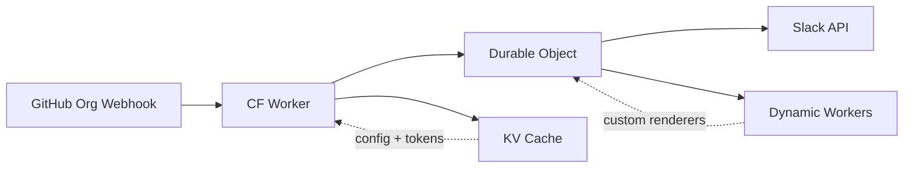

# mw-gha-slack-notify

Cloudflare Worker that posts real-time GitHub Actions workflow status to Slack. Replaces [action-slacksync](https://github.com/MasterworksIO/action-slacksync) — no more `prepare`/`conclusion` jobs or per-job action steps.



## How it works

1. A GitHub App webhook fires `workflow_run` and `workflow_job` events
2. The Worker verifies the signature and routes to a Durable Object (one per org+env)
3. The DO posts a Slack message on the first event, then updates it as jobs progress
4. Custom renderer JS files (fetched from the repo) run in isolated Dynamic Workers

## Usage

Add two env vars to any workflow to opt in:

```yaml
env:
  SLACK_NOTIFY_CHANNEL: 'C012NUFBCLU'
  SLACK_NOTIFY_RENDERER: '.github/slack-notify.deploy.js' # optional
```

Without a renderer, a minimal default is used (job names, status colors, durations).

### Custom renderers

Plain JS files — no Cloudflare deps required. Export a default function:

```javascript
// .github/slack-notify.deploy.js

/** @type {import('@masterworks/mw-gha-slack-notify').Renderer} */
export default function render({ workflow_run, jobs }) {
  return {
    text: `${workflow_run.name} on ${workflow_run.repository.full_name}`,
    blocks: [
      { type: 'section', text: { type: 'mrkdwn', text: `> ${workflow_run.head_commit?.message}` } },
    ],
    attachments: jobs.map((job) => ({
      color: job.conclusion === 'success' ? '#2eb886' : '#a30200',
      text: job.name,
    })),
  }
}
```

For TypeScript, install the types package for `RendererInput` and `RendererOutput`:

```
pnpm add -D @masterworks/mw-gha-slack-notify@github:MasterworksIO/mw-gha-slack-notify
```

## Setup

### Prerequisites

- Cloudflare account with Workers, Durable Objects, and KV
- GitHub App installed on the org (permissions: `contents:read`, `actions:read`)
- Slack Bot Token with `chat:write` and `chat:write.customize` scopes

### Secrets

```bash
wrangler secret put GITHUB_APP_ID
wrangler secret put GITHUB_PRIVATE_KEY    # PKCS#8 PEM
wrangler secret put GITHUB_WEBHOOK_SECRET
wrangler secret put SLACK_BOT_TOKEN       # xoxb-...
```

### Deploy

```bash
pnpm install
pnpm -F mw-gha-slack-notify-worker deploy
```

## Development

```bash
pnpm install
pnpm -F mw-gha-slack-notify-worker dev  # wrangler dev
pnpm typecheck                           # tsgo --noEmit (recursive)
pnpm test                                # vitest (recursive)
pnpm lint                                # oxlint
pnpm format                              # oxfmt
```

## Project structure

```
packages/
  worker/     CF Worker: webhook handling, DO, Slack API, GitHub App auth
  types/      Slim types package: RendererInput, RendererOutput
```
